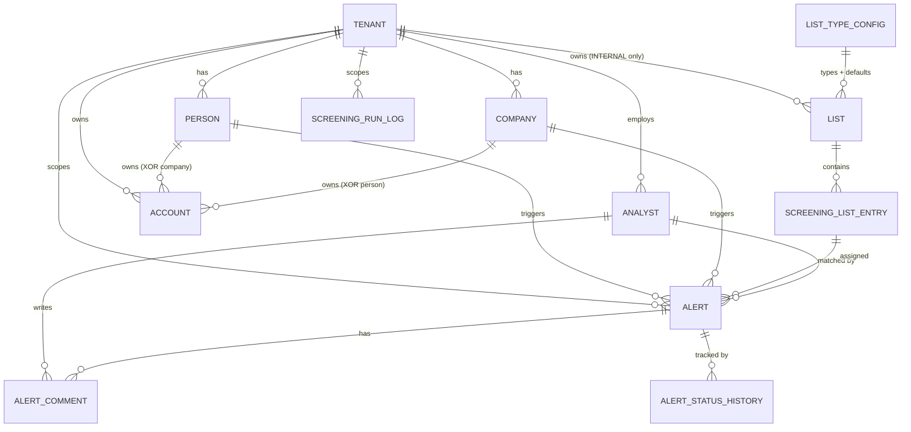

# Motor de Screening — Challenge Técnico Complif

Motor de compliance screening multi-tenant construido sobre PostgreSQL 17.
Procesa matching fuzzy contra listas de sancionados (OFAC, UN, PEP, adverse
media), valida documentos de identidad con reglas por jurisdicción (AR, CL,
US, BR) y genera alertas ponderadas para revisión por analistas.

---

## Quick start

**Requisitos:** Docker Desktop instalado y corriendo.

```bash
# 1. Levantar el stack (primera vez tarda ~1-2 min bajando la imagen)
docker compose up -d

# 2. Ver el progreso del init (4 fases: extensiones, baseline, migrations, seeds)
docker compose logs -f db
# Esperás ver "Inicialización completa. DB lista: complif"

# 3. Conectarse
docker compose exec db psql -U complif_admin -d complif

# 4. Probar un screening con los seeds cargados
SELECT * FROM public.run_screening(
    'PERSON',
    '30000000-0000-0000-0000-000000000001'::uuid,  -- Juan Pérez (AR)
    NULL                                            -- contra todas las listas
);

# 5. (opcional) Correr el tour guiado completo en una sola pasada
docker compose exec db psql -U complif_admin -d complif -f /repo/demo/tour.sql

# 6. Bajar (mantiene data) o reset limpio (borra volumen)
docker compose down
docker compose down -v
```

**Credenciales default (solo dev):**

| Rol | Password | Cuándo usarlo |
|---|---|---|
| `complif_admin` | `complif_dev_insecure` | Migraciones, seeds, tareas administrativas. Es **SUPERUSER y bypasea RLS** — útil para admin pero no para demostrar el aislamiento multi-tenant. |
| `complif_app` | `complif_app_dev` | El que usa la app/tour en runtime. **NOSUPERUSER + NOBYPASSRLS** → las policies de V004 sí se aplican. Creado por la migration V011. |

Puerto expuesto en el host: `5433` (mapea al `5432` interno del container;
el 5433 evita conflictos con un Postgres local típico de Windows/macOS que
suele ocupar el 5432).

**Siguientes pasos recomendados:**

1. Leer la sección [Cómo fluye la data en producción](#cómo-fluye-la-data-en-producción) para entender de dónde sale cada pieza del dataset.
2. Seguir el [Tour guiado (10 minutos)](#tour-guiado-10-minutos) para ver el motor en acción con queries comentadas.
3. (Opcional) Conectar un [cliente GUI](#conexión-con-cliente-gui-opcional) como DBeaver si preferís explorar con interfaz gráfica.

---

## Cómo fluye la data en producción

El repo viene con seeds pre-cargados para que el tour funcione sin setup
adicional, pero es útil entender **de dónde saldría cada tabla en un
deployment real de Complif**. El motor tiene cuatro "entradas" de data
distintas, cada una con su propio flujo:

### Onboarding del tenant

Un tenant (ej: "Banco Galicia") se da de alta cuando Complif lo contrata
como cliente. Operación manual o via panel de admin de Complif — pocas
por año, no es un flujo automatizado. En el momento del alta se crean el
`tenant` y sus `analyst` iniciales (los compliance officers del banco que
usarán la plataforma).

### Master data del cliente (`person` / `company` / `account`)

Estos son los clientes del banco (los usuarios finales). Se populan por
**integración API** con el core system del tenant: cada vez que el banco
onboardea un nuevo usuario, su sistema dispara un `POST /persons` (o
`/companies`) contra la API de Complif pasando los datos. Complif recibe
y persiste. Para migraciones masivas o carga inicial: bulk upload de CSV
via UI de admin, o SFTP drop con un ETL detrás.

En este repo no hay capa de API — los seeds los insertan directamente.
Pero el ciclo de vida conceptual es: onboarding del usuario en el
tenant → API call → fila en `person`/`company` → disponible para
screening.

### Listas de screening: dos fuentes distintas

| Tipo de lista | Fuente | Quién la mantiene |
|---|---|---|
| `SANCTIONS` (OFAC SDN, UN Consolidated) | Publicaciones oficiales (OFAC saca feeds diarios en XML/CSV, UN publica su Consolidated List) | **Complif centralmente** — cron/worker sincroniza diario o por webhook cuando hay update. Fila en `list` con `tenant_id=NULL` + entries en `screening_list_entry`. |
| `PEP` | Proveedores comerciales (Dow Jones Risk Center, Refinitiv World-Check, ComplyAdvantage) | **Complif** — subscripción paga, sincronización vía API del proveedor. `tenant_id=NULL`. |
| `ADVERSE_MEDIA` | Scrapers de prensa + feeds de riesgo reputacional comprados | **Complif** — pipelines de scraping/ETL. `tenant_id=NULL`. |
| `INTERNAL_BLACKLIST` / `INTERNAL_WATCHLIST` | El propio tenant | **El cliente**, vía UI de admin de Complif o API. Cada fila con su `tenant_id` y visible solo para ese tenant. Caso típico: ex-clientes fraudulentos, personas bloqueadas por riesgo reputacional interno. |

Las listas globales son el valor agregado de Complif: mantener OFAC
fresco (falso negativo = multa regulatoria para el banco) y PEP curado
requiere inversión continua que un banco individual no querría replicar.

### Ejecución del screening (`alert`, `screening_run_log`)

Tres triggers posibles para que corra `run_screening`:

- **On-demand / onboarding**: el core system del banco llama al disparar
  el alta de un cliente nuevo. Latencia baja — el banco espera el
  resultado para continuar el flujo de KYC. Genera `alert` si hay match.
- **Batch**: `run_batch_screening` procesa todas las entidades de un
  tenant (o un subset), útil para cargas iniciales tras onboardear un
  tenant nuevo con millones de clientes históricos. Cada invocación
  registra una fila en `screening_run_log`.
- **Ongoing monitoring**: `run_ongoing_screening` re-screenea entidades
  cuyas listas se actualizaron desde el último check. Típicamente cron
  diario o por-webhook cuando OFAC publica update. La vista
  `vw_entities_pending_screening` alimenta este loop.

Cuando un screening supera el umbral de `list.min_similarity` (o el
default de `list_type_config`), se crea una fila en `alert` con status
`PENDING`. El `detail jsonb` guarda el breakdown completo para que el
analista después entienda por qué se disparó.

### Workflow del analista (`alert_comment`, `alert_status_history`)

Las alertas pendientes aparecen en el dashboard del compliance officer
del tenant (alimentado por `vw_alert_aging`, `vw_pending_alerts_by_analyst`).
El analista:

1. Se asigna una alerta (`UPDATE alert SET analyst_id = ..., status = 'REVIEWING'`).
2. Investiga y escribe notas (`INSERT INTO alert_comment`).
3. Resuelve: `CONFIRMED` (es el sancionado, bloquea operación), `DISMISSED`
   (falso positivo, libera al cliente), o deja `REVIEWING` si necesita
   más información.

Cada cambio de `alert.status` dispara el trigger `log_alert_status_change`
que inserta una fila en `alert_status_history` — audit trail inmutable
para auditoría regulatoria ("¿quién aprobó esta operación y cuándo?").

### Resumen visual del ciclo

```
┌──────────────┐     onboarding
│   Complif    │────────────────────> tenant, analyst
│   (admin)    │                      (bajo volumen, manual)
└──────┬───────┘
       │ ETL diario desde OFAC/UN/Dow Jones
       ▼
┌────────────────────────┐
│  list (tenant_id NULL) │  +  screening_list_entry
│  SANCTIONS, PEP,       │
│  ADVERSE_MEDIA         │
└────────────────────────┘
                                ┌──────────────┐
                                │   Tenant     │ (el banco/fintech)
                                │   (cliente   │
                                │    Complif)  │
                                └──────┬───────┘
                                       │ API calls al onboardear sus clientes
                                       ▼
                                 person, company, account
                                       │
                                       │ (disparo de screening: on-demand,
                                       │  batch, u ongoing)
                                       ▼
                                 run_screening()
                                       │
                                       │ (si supera umbral)
                                       ▼
                                  alert (PENDING)
                                       │
                                       │ analista revisa,
                                       │ asigna, comenta, resuelve
                                       ▼
                         alert_comment, alert_status_history
                         (status: REVIEWING → CONFIRMED/DISMISSED)
```

---

## Tour guiado (10 minutos)

8 pasos que muestran el motor end-to-end sin tener que leer código. Cada
paso con query + qué esperar + qué concepto demuestra.

Para correr **todo el tour de un tirón**:

```bash
docker compose exec db psql -U complif_admin -d complif -f /repo/demo/tour.sql
```

Para correrlo **de forma didáctica** (paso a paso leyendo los resultados),
abrí una sesión psql y copiá/pegá cada paso desde `demo/tour.sql`:

```bash
docker compose exec db psql -U complif_admin -d complif
# Dentro del psql:
\x auto   -- formato vertical automático, mejora lectura de JSON detail
```

### Paso 1 — Ver tenants

```sql
SELECT id, name FROM public.tenant ORDER BY name;
```

Esperás ver 2 filas: Acme (AR) y Globex (LATAM). En producción habría
decenas o cientos — bancos y fintechs que usan Complif.

### Paso 2 — Contextualizarte como Acme

```sql
SET app.tenant_id = '10000000-0000-0000-0000-000000000001';

SELECT first_name, last_name, country, tax_id
FROM public.person ORDER BY last_name;
```

A partir del `SET`, todas las queries quedan scopeadas por RLS. Ves 3
personas de Acme (Juan Pérez, María González, Ricardo Fernández —
Ricardo con tax_id placeholder para ejercitar el edge case del Paso 5).

### Paso 3 — Listas disponibles

```sql
SELECT name, type, tenant_id FROM public.list ORDER BY tenant_id NULLS FIRST;
```

4 listas globales (OFAC SDN, UN Consolidated, PEP Global, Adverse Media)
+ 1 interna de Acme. Las globales las mantendría Complif
centralmente; la interna la carga el propio cliente.

### Paso 4 — Match fuerte: Juan Pérez contra OFAC

```sql
SELECT * FROM public.run_screening(
    'PERSON',
    '30000000-0000-0000-0000-000000000001'::uuid,
    NULL
);
```

Devuelve 1 fila, `similarity_score = 100`, `list_name = "OFAC SDN"`.
Abrí `match_details` (el JSON) para ver el breakdown:
`name_similarity`, `tax_id_match`, `birth_date_score`, y los
`weights_applied`. Los 3 componentes están en su máximo → score total
100.

### Paso 5 — Match con peso degradado (placeholder tax_id)

```sql
SELECT * FROM public.run_screening(
    'PERSON',
    '30000000-0000-0000-0000-000000000003'::uuid,  -- Ricardo Fernández
    NULL
);
```

Ricardo tiene `tax_id = '99999999999'` (placeholder). Hay una entry en
UN Consolidated con el mismo placeholder. El match existe (por nombre
fuzzy) pero el peso del tax_id **colapsa a 0** porque el validador
detecta `PLACEHOLDER`. En `match_details` vas a ver
`weights_applied.tax_id = 0` y una razón asociada. Es el detalle de
diseño más importante del motor: un match entre placeholders no es
signal de identidad, es signal de data quality basura.

### Paso 6 — Validador de tax_id aislado

```sql
SELECT * FROM public.validate_tax_id('20-12345678-6', 'AR');  -- VALID
SELECT * FROM public.validate_tax_id('99999999999', 'AR');    -- PLACEHOLDER
SELECT * FROM public.validate_tax_id('20-12345678-0', 'AR');  -- INVALID_CHECKSUM
SELECT * FROM public.validate_tax_id('12345678901', 'FR');    -- UNKNOWN_COUNTRY
```

La función es reutilizable fuera del screening (un analista verificando
un doc suelto, por ejemplo). Categoriza en: VALID, INVALID_FORMAT,
INVALID_CHECKSUM, PLACEHOLDER, SEQUENTIAL, MISSING, TOO_SHORT, TOO_LONG,
UNKNOWN_COUNTRY.

### Paso 7 — Cambiar tenant: aislamiento RLS en acción

```sql
SET app.tenant_id = '10000000-0000-0000-0000-000000000002';  -- Globex

SELECT first_name, last_name, country FROM public.person ORDER BY last_name;
SELECT COUNT(*) FROM public.alert;
```

Mismo SQL que el Paso 2, **resultados completamente distintos**: ahora
ves Pedro Muñoz (CL), John Smith (US), João Silva (BR). Los de Acme
desaparecieron. Las alertas pre-cargadas también: 0 visibles desde
Globex porque son todas de Acme. Postgres filtra transparente — el
código de app nunca escribe un `WHERE tenant_id = ...`.

### Paso 8 — Vistas de reporting

```sql
SET app.tenant_id = '10000000-0000-0000-0000-000000000001';  -- volver a Acme

SELECT * FROM public.vw_alert_aging;
SELECT * FROM public.vw_pending_alerts_by_analyst;
SELECT * FROM public.vw_screening_metrics;
```

Las vistas son el contrato público consumido por el dashboard de
compliance. Respetan RLS transitivamente.

---

## Conexión con cliente GUI (opcional)

Si preferís explorar la DB con interfaz gráfica en vez de psql, cualquier
cliente Postgres funciona contra `localhost:5433`.

**DBeaver (gotcha conocido)**: en Windows con timezone local argentina,
la JVM reporta `America/Buenos_Aires` (nombre legacy) y Postgres 17
solo acepta `America/Argentina/Buenos_Aires` (nombre IANA actual). La
conexión falla con `FATAL: invalid value for parameter "TimeZone"`.

Fix más simple (per-conexión, sin tocar instalación):

1. Editar conexión → pestaña **Driver properties**.
2. Agregar property: `options` = `-c TimeZone=UTC`.
3. Guardar y reconectar.

Alternativa global: editar `dbeaver.ini` (en el directorio de instalación
de DBeaver) y agregar `-Duser.timezone=UTC` después de la línea `-vmargs`.
Reiniciar DBeaver.

---

## Problema y contexto

Complif necesita detectar si sus clientes (personas o empresas) están en
listas de riesgo regulatorio. El motor debe:

- Hacer matching **fuzzy** (Juan Pérez ≈ Jon Perez ≈ J. Perez) porque las
  listas OFAC/UN tienen transliteraciones, abreviaturas y typos.
- Validar **tax IDs por jurisdicción** (un CUIT argentino no tiene el mismo
  formato que un SSN americano) y detectar placeholders como `99999999999`
  que inflan matches falsos.
- Ser **multi-tenant** con aislamiento estricto entre clientes de Complif.
- Escalar: una lista OFAC tiene ~25k entries, un cliente puede tener miles
  de personas, y hay batch screenings masivos.
- Ser **auditable**: cada match guarda el breakdown del score (name fuzzy,
  tax_id match, birth_date, weighting) para que un analista entienda por
  qué se disparó una alerta.

---

## Arquitectura

### ERD (diagrama relacional)



**Tablas principales:**

- `tenant` — raíz de aislamiento multi-tenant.
- `person` / `company` — entidades a screenear del cliente.
- `account` — cuentas/relaciones comerciales que el tenant abre para una
  `person` o `company` (mutuamente exclusivas por check constraint). Es el
  "punto de contacto" sobre el que se dispara screening (ej: onboarding).
- `list` — catálogo de listas de riesgo. `tenant_id` NULL = lista global
  (SANCTIONS, PEP); no-NULL = lista privada del tenant (INTERNAL blacklist).
- `list_type_config` — defaults de `default_min_similarity` por tipo de
  lista; SANCTIONS con umbral bajo (0.65) porque falso negativo = multa
  regulatoria; INTERNAL con umbral alto (0.88) porque falso positivo =
  ruido para el analista.
- `screening_list_entry` — los sancionados/PEPs individuales. Hereda
  visibilidad vía FK a `list` (no tiene `tenant_id` propio).
- `alert` — match generado por el motor. Guarda `similarity_score`,
  `detail jsonb` con el breakdown, y estado de workflow
  (PENDING / REVIEWING / CONFIRMED / DISMISSED).
- `alert_status_history` — audit trail poblado por trigger.
- `alert_comment` — notas del analista.
- `screening_run_log` — registro de cada invocación batch/ongoing.

### Vistas de reporting

Las vistas no forman parte del ERD (son proyecciones derivadas, no
entidades) pero sí son parte del contrato público del motor: lo que el
frontend de compliance consulta para poblar dashboards. Todas respetan
RLS transitivamente — consultan tablas con policies activas.

| Vista                           | Propósito                                              | Origen   |
|---------------------------------|--------------------------------------------------------|----------|
| `vw_alert_aging`                | Alertas pendientes clasificadas por antigüedad (buckets 0-1d, 1-7d, 7-30d, >30d) para priorización diaria del equipo. | baseline |
| `vw_pending_alerts_by_analyst`  | Workload actual de cada analista (alertas PENDING/REVIEWING asignadas), para balancear carga. | baseline |
| `vw_analyst_productivity`       | Métrica de throughput por analista (alertas cerradas, tasa de confirmación vs dismissal). | baseline |
| `vw_screening_metrics`          | KPIs globales por tenant: totales, pendientes, tasa de falsos positivos. | baseline |
| `vw_screening_coverage`         | Cobertura: qué porcentaje de las entidades del tenant ya fue screeneada al menos una vez. | baseline |
| `vw_entities_pending_screening` | Entidades que necesitan (re-)screening: nunca corridas o cuya última corrida es anterior al último cambio de las listas. Alimenta el loop de ongoing monitoring. | V007     |

### Componentes del motor

```
┌─────────────────────────────────────────────────────────┐
│                     run_screening                        │
│          (orquesta: entity → matches → alerts)           │
└───────────────────────┬─────────────────────────────────┘
                        │ llama
                        ▼
┌─────────────────────────────────────────────────────────┐
│              calculate_similarity                        │
│   peso ponderado: name (0.5) + tax_id (0-0.3) + dob(0.2) │
│   con validación country-aware del tax_id por lado       │
└──────┬──────────────────────────────────┬───────────────┘
       │                                  │
       ▼                                  ▼
┌──────────────────┐              ┌───────────────────────┐
│ normalize_name   │              │  validate_tax_id      │
│ normalize_tax_id │              │  (AR/CL/US/BR)        │
│ (unaccent,lower) │              │  + generic checks     │
└──────────────────┘              │  (placeholder, seq)   │
                                  └───────────────────────┘
```

---

## Estructura del repo

```
.
├── docker-compose.yml              # Stack de dev (Postgres 17 + init)
├── docker/
│   └── init/
│       └── 01-init.sh              # Orquesta boot del container
├── migrations/                     # Schema evolution (V000..V010)
│   ├── V000__extensions.sql
│   ├── V001__tax_id_to_text.sql
│   ├── ...
│   ├── V010__security_definer_and_minor_fixes.sql
│   └── tests/                      # Tests SQL por migración
│       ├── test_V008__tax_id_validation.sql
│       ├── test_V009__...sql
│       └── test_V010__...sql
├── seeds/
│   └── seed_data.sql               # Dataset de demo
├── baseline/                       # DDL inicial (pre-migraciones)
│   ├── tables/                     # 10 tablas del schema base
│   ├── functions/                  # 5 funciones (similarity, tax_id, etc.)
│   ├── triggers/                   # Triggers de auditoría (status history)
│   └── views/                      # 5 dashboards (aging, productivity, etc.)
├── docs/
│   └── legacy/
│       └── inserts/                # Inserts originales (reemplazados por seeds/)
└── README.md
```

---

## Decisiones de diseño clave

### 1. Multi-tenancy con Row-Level Security

RLS activa por tabla con `FORCE ROW LEVEL SECURITY` (aplica también al
owner) y policies que filtran por `public.current_tenant_id()`, un helper
que lee `current_setting('app.tenant_id', true)`. Cada conexión hace
`SET app.tenant_id = '...'` al autenticarse → todas las queries quedan
scopeadas automáticamente.

`screening_list_entry` **no tiene** `tenant_id`: hereda visibilidad vía
JOIN con `list`. Razón: las listas globales (OFAC) son compartidas por
todos los tenants, y duplicar cada entry por tenant escala mal (25k entries
× N tenants).

> ⚠️ **Importante:** los SUPERUSER **bypasean RLS por definición de Postgres**,
> aunque la tabla tenga `FORCE ROW LEVEL SECURITY`. Por eso V011 crea el rol
> `complif_app` (NOSUPERUSER + NOBYPASSRLS): el motor solo demuestra
> aislamiento real cuando la sesión usa ese rol. El tour ejecuta
> `SET ROLE complif_app;` al inicio. Si te conectás como `complif_admin` y
> ves filas cross-tenant, **es esto** — no un bug en las policies.

### 2. Similarity ponderada con pesos degradables

El score final = promedio ponderado de 3 componentes, normalizado:

| Componente | Peso default | Degradable a |
|---|---|---|
| Nombre (trigram similarity + unaccent) | 0.5 | — siempre pesa |
| Tax ID (equality sobre normalizado) | 0.3 | 0.15 / 0 |
| Birth date (exacta=1, mismo año=0.5) | 0.2 | — o skip si NULL |

El peso del tax_id degrada según validación:

- **0.30** — ambos VALID o UNKNOWN_COUNTRY (pasó checks genéricos).
- **0.15** — alguno INVALID_CHECKSUM sin placeholder (match entre checksums
  rotos random sigue dando algo de signal de identidad).
- **0.00** — placeholder / secuencial / formato roto en cualquier lado.
  Un match tipo `99999999999 = 99999999999` **no** es signal de identidad.

### 3. Validación country-aware de tax IDs

`validate_tax_id(p_tax_id, p_country)` categoriza en:
`VALID | INVALID_FORMAT | INVALID_CHECKSUM | PLACEHOLDER | SEQUENTIAL | MISSING | UNKNOWN_COUNTRY | TOO_SHORT | TOO_LONG`.

Implementa checksums mod-11 país-específicos (CUIT AR, RUT CL, SSN US,
CPF/CNPJ BR) más checks genéricos (todos el mismo dígito, secuencial
ascendente/descendente).

**Doble país en `calculate_similarity`** (V009): cada tax_id se valida con
su propio país. Sin esto, un person AR vs entry US obligaba a elegir un
único country → validar CUIT con reglas SSN daba INVALID_FORMAT espurio.

### 4. Dos capas de alerta

- **Identity matching** (`similarity_score`) — ¿esta persona ES la de la
  lista? El motor decide.
- **Data quality red flags** (`detail.tax_id_validation`) — ¿este tax_id
  es sospechoso? Separado del score para que un analista lo evalúe.

Un tax_id placeholder nunca infla el score (peso 0), pero queda guardado
en `detail` como red flag independiente. El analista ve ambas señales.

### 5. SECURITY DEFINER en funciones de escritura

Las tres funciones que INSERTan en `alert` (`run_screening`,
`run_batch_screening`, `run_ongoing_screening`) corren con SECURITY DEFINER
para permitir que un rol de app con solo `GRANT EXECUTE` pueda disparar
screenings sin `INSERT` directo en `alert`.

`SET search_path = pg_catalog, public` es obligatorio — sin él, SECURITY
DEFINER es vulnerable a search_path injection (un schema temporal con
un `similarity()` malicioso se resolvería primero).

Las funciones puras (`calculate_similarity`, `validate_tax_id`,
`normalize_*`) quedan como SECURITY INVOKER — principio de mínimo privilegio.

### 6. `alert.detail` como JSONB + índice GIN

`detail` guarda breakdown estructurado del match
(`name_similarity`, `tax_id_match`, `weights_applied`, `tax_id_validation`).
JSONB + índice GIN con `jsonb_path_ops` permite queries típicas de analista:

```sql
-- Alertas con tax_id degradado por placeholder
SELECT * FROM alert
WHERE detail @> '{"tax_id_validation": {"downgraded": true}}';

-- Alertas con checksum inválido
SELECT * FROM alert
WHERE detail->'tax_id_validation'->'input'->>'category' = 'INVALID_CHECKSUM';
```

### 7. Índices optimizados para el hot path

- **GIN trigram** en `person.first_name`, `last_name`, `company.name`,
  `screening_list_entry.full_name` normalizados — para el `similarity() >=`
  del name matching.
- **B-tree compuesto** `(tax_id_normalized, country)` — búsqueda exacta
  country-aware es el 90% de las queries de `search_by_tax_id`.
- **B-tree en FKs** — mandatorio para que los JOINs grandes no degeneren
  a seq-scan.

---

## Evolución del schema

| # | Migración | Qué hace | Por qué |
|---|---|---|---|
| V000 | `extensions` | Habilita `pg_trgm`, `fuzzystrmatch`, `unaccent`, `uuid-ossp` | Pre-requisito del resto |
| V001 | `tax_id_to_text` | `tax_id` bigint → text; agrega `country` a person; `tax_id_normalized` como GENERATED | Soportar CUIT con guiones, SSN con guiones, CPF con puntos |
| V002 | `f_unaccent_wrapper` | Wrapper IMMUTABLE de `unaccent` | `unaccent` es STABLE, no se puede usar en índices — el wrapper sí |
| V003 | `indexes` | GIN trigram + B-tree + FK indexes | Performance del hot path |
| V004 | `rls_policies` | RLS + policies por tabla | Multi-tenancy estricto |
| V005 | `similarity_thresholds` | `list_type_config` + `list.min_similarity` + `resolve_similarity_threshold()` | Umbrales diferenciados por tipo de lista |
| V006 | `run_screening_company_and_weighting_fix` | `run_screening` acepta COMPANY; fix weighting normalization | Extender scope + bug fix |
| V007 | `screening_batch_and_ongoing` | `run_batch_screening`, `run_ongoing_screening`, `screening_run_log` | Casos de uso beyond ad-hoc |
| V008 | `tax_id_validation` | Validador country-aware; extiende `search_by_tax_id`; suma `p_country` a `calculate_similarity` | Detección de placeholders + identidad real |
| V009 | `run_screening_country_aware_validation` | `calculate_similarity` con DOS países (entity + entry); `run_screening` propaga ambos | Fix de validación cross-jurisdiction |
| V010 | `security_definer_and_minor_fixes` | SECURITY DEFINER + `search_path` en run_screening*; `alert_status_check`; `alert.detail` → jsonb + GIN | Seguridad + quality fixes |
| V011 | `app_role` | Crea rol `complif_app` NOSUPERUSER + NOBYPASSRLS con DML/EXECUTE | Sin esto, RLS se bypasea porque `complif_admin` es SUPERUSER |

---

## Testing

Tests SQL por migración en `migrations/tests/`. Cada archivo se ejecuta
dentro de una transacción con `ROLLBACK` al final, para que los tests no
dejen residuo en la DB.

```bash
# Correr un test específico
docker compose exec db psql -U complif_admin -d complif \
    -f /repo/migrations/tests/test_V010__security_definer_and_minor_fixes.sql

# Correr todos los tests en orden
docker compose exec db bash -c '
    for t in /repo/migrations/tests/test_V*.sql; do
        echo "=== $t ===";
        psql -U complif_admin -d complif -f "$t";
    done
'
```

**Qué cubren los tests:**

- `test_V008` — 8 secciones con ~50 casos: validación genérica, AR CUIT,
  CL RUT, US SSN/ITIN, BR CPF/CNPJ, unknown country, similarity con/sin
  country, search_by_tax_id con validation.
- `test_V009` — 7 secciones: dos países en similarity, bug fix de
  placeholder-con-NULL-country, cross-jurisdiction sin falsos positivos,
  TAX_ID_EXACT no disparado si peso degradado, run_screening E2E.
- `test_V010` — 3 checks vía catálogos: SECURITY DEFINER + search_path,
  alert_status_check constraint, alert.detail jsonb + GIN.

---

## Roadmap futuro

Cosas que quedaron fuera del scope del challenge, con criterio de cuándo
activarlas:

- **Particionar `alert` y `alert_status_history`** — RANGE partitioning por
  `created_at` (mensual). **Trigger:** cuando `alert` supere ~10M rows o
  las queries de aging empiecen a degradar. Migración preparada pero no
  aplicada para mantener el DDL simple en esta fase.
- **Framework de tests pgTAP** — los tests actuales son archivos `.sql` con
  `SELECT` auto-descriptivos, lo cual es legible pero no se integra a CI
  como test runner. **Trigger:** cuando el team tenga >3 devs tocando
  migraciones y necesiten pass/fail automatizado en PRs.
- **Benchmarks de performance documentados** — dataset sintético de 100k
  persons × 25k entries OFAC con `EXPLAIN ANALYZE` documentado por query
  crítica. **Trigger:** antes de primer release productivo.
- **Enhanced Due Diligence (EDD) por nacionalidad** — motor separado que
  usa `person.nationality` (no `country`) para flags regulatorios
  (ciudadanos de países sancionados requieren EDD independiente del
  domicilio). No mezclarlo con identity matching.
- **Estandarizar `nationality` a ISO 3166-1 alpha-2** — hoy es varchar
  libre ('Argentina'). Migración trivial, pero requiere limpiar data
  existente.

---

## Setup de desarrollo asistido por IA

Este repo está preparado para trabajar con agentes (Claude Code, Cursor,
Copilot Workspace, etc.) como primera-clase. Tres archivos materializan eso:

- **`AGENTS.md`** (raíz) — fuente canónica de convenciones, playbooks y
  gotchas del dominio. Cualquier agente que abra el repo debería cargarlo
  primero. Incluye: principios de trabajo, naming, hot path mental,
  conceptos de compliance, weighting de similarity, cómo agregar una nueva
  jurisdicción, cómo escribir una nueva migración, qué NO hacer, y cómo
  verificar cambios.

- **`.cursor/rules/complif.mdc`** — versión accionable para Cursor con
  auto-load en files de `migrations/`, `seeds/`, `SQL *`, `docker/`.
  Formato MDC (front-matter + markdown); Cursor lo aplica automáticamente
  cuando el contexto matchea los globs. Referencia `AGENTS.md` para
  detalles largos.

- **`.mcp.example.json`** — config de MCP Postgres server. Renombrar a
  `.mcp.json` para activarlo en Claude Code / Claude Desktop. Permite que
  el agente queree la DB durante desarrollo (tablas, funciones, data).
  Recomendación: crear un rol `complif_readonly` y usarlo en vez del admin.

**Por qué este setup:** los repos productivos de AI-assisted development
comparten un patrón — un único "agents manifest" que el humano mantiene,
y wrappers por herramienta (Cursor, Claude, etc.) que referencian ese
manifest en vez de duplicarlo. Si cambia una convención, se edita en un
solo lugar.

---

## Convenciones

- **Migraciones:** `V###__descripción_snake_case.sql`. Numeración estricta,
  nunca se re-numeran ni se editan aplicadas.
- **Idempotencia:** toda migración debe poder re-correrse sin romper. Patrón:
  `DROP ... IF EXISTS` + `CREATE ... IF NOT EXISTS`, o bloques `DO` con
  check de estado previo en `information_schema` / `pg_catalog`.
- **Transacciones:** cada migración va envuelta en `BEGIN ... COMMIT`.
  Atomicidad total o rollback completo.
- **Comentarios en migraciones:** header con el *por qué* (no el *qué* —
  el SQL ya lo dice). El rationale es lo que se pierde si no lo escribís.
- **Comments SQL:** `COMMENT ON FUNCTION/TABLE/COLUMN` para documentación
  in-DB, consultable con `\df+`.
